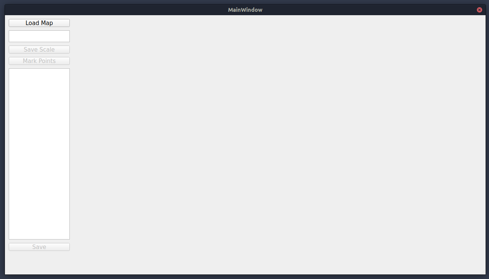

# MapMarker
Simple application created with QT5 to mark points on map and save their coordinates.
# Setup
## Easy Way
Go Release page and download the AppImage according your system.
If your glibc version >=2.31 && <= 2.34, you can go to 0.1-20.04 version.
## Manually Compile
Clone this project.
```
git clone https://github.com/Steve-Mr/MapMarker.git
```
Create output folder
```
cd MapMarker
mkdir output && cd output
```
Now Compile the porject.
```
qmake ../MapMarker.pro
make
```
then you will find executable MapMarker in the output folder.
# How to Use
MapMarker should look like this.
  

Load Map: Choose pgm map to show in right area.
Input the scale (meter per pixel) and "Save Scale", then "Mark Points" will be clickable.
Click "Mark Points" to mark on the right area.
# TODO
- [ ] Tide up the code
- [ ] Implement painting on map by inherit QLabel class
- [ ] Custom Map/Image Viewer
